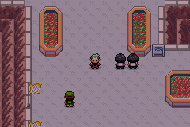

# Emerald Battle Factory Modern

<div class="gif-row">
  
  
  
</div>

Emerald Battle Factory Modern modernises (very original name!) the Battle Factory to leverage [pokeemerald-expansion](https://github.com/rh-hideout/pokeemerald-expansion), 
using its modern battle engine and support for Pokémon from Generations 1–9.

## What this project adds

- A broad roster of Pokémon from Generations 1–9
- Generation 9 battle mechanics and Pokémon data, without battle gimmicks
- Viable, source-backed movesets with explicit abilities, items, natures, and EVs
- Direct startup outside the Battle Factory for faster testing
- Configurable battle speed, overworld speed, and text speed
- Expanded trainer AI as the Factory challenges become harder

See the [full feature list](FEATURES.md) for the current scope.

## Documentation

The documentation covers the [Battle Factory mechanics](docs/battle_factory_mechanics.md) and the [generated set catalogue](docs/battle_factory_sets.md).

The hosted documentation site is available at:

<https://acb17rmh.github.io/emerald-battle-factory-modern/>

To run it locally with MdBook:

```bash
cd docs
mdbook serve --open
```

## Getting started

See [INSTALL.md](INSTALL.md) for environment setup and build instructions.

Once the required tools are installed, build the ROM with:

```bash
make
```

## Project scope

This project uses the modern battle mechanics and Pokémon content provided through Generation 9. It intentionally does not use battle gimmicks such as Mega Evolution, Z-Moves, Dynamax, Gigantamax, or Terastallization.

It is intentionally focused on the Battle Factory. For now I want to keep the scope of the project small so it is easier to maintain.

## Credits

This project depends on the work in [pokeemerald](https://github.com/pret/pokeemerald) and [pokeemerald-expansion](https://github.com/rh-hideout/pokeemerald-expansion). See [CREDITS.md](CREDITS.md) for contributors and upstream acknowledgements.
